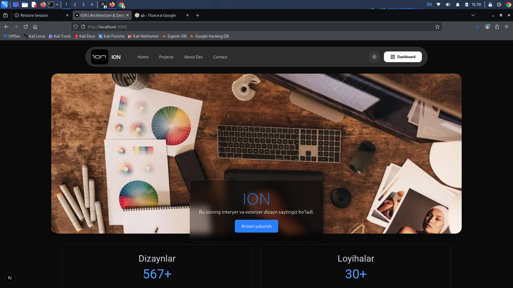
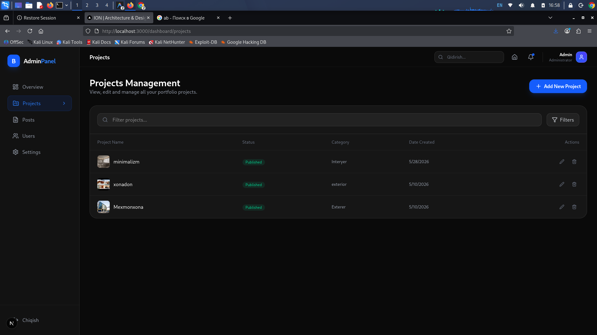
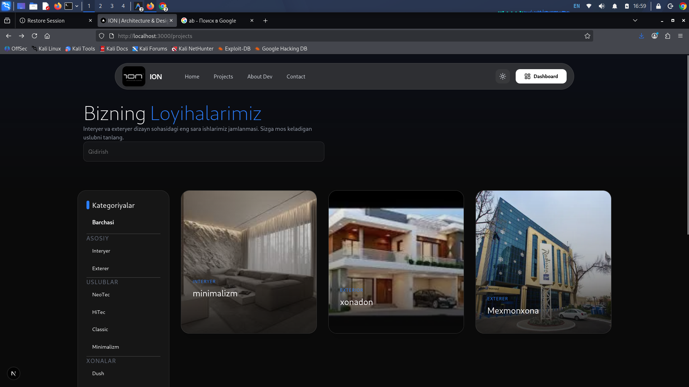
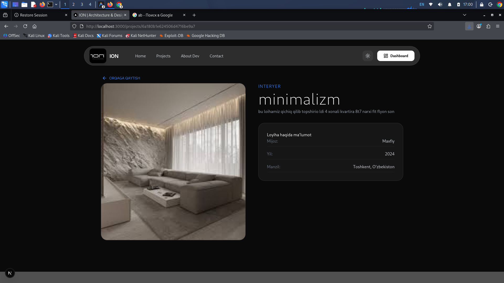

<p align="center">
  
</p>

<h1 align="center">ION — Architecture & Design Blog</h1>

<p align="center">
  <strong>Zamonaviy interyer va eksteryer dizayn studiyasi uchun blog platforma</strong>
</p>

<p align="center">
  
  
  
  
  
</p>

---

## 📸 Screenlar

<p align="center">
  
</p>

<p align="center">
  
</p>

<p align="center">
  
</p>

<p align="center">
  
</p>

---

## 🛠 Texnologiyalar (Tech Stack)

| Qism | Texnologiya |
|------|-------------|
| **Frontend** | Next.js 16, React 19, TypeScript |
| **UI** | MUI v9, Tailwind CSS v4, Lucide Icons |
| **State** | Zustand |
| **Backend** | Express.js 5, Node.js |
| **Database** | MongoDB (Mongoose 9) |
| **Deploy** | Railway |

---

## 📁 Loyiha Tuzilishi

```
ion-blog-site/
├── my-app/                 # Frontend (Next.js)
│   ├── app/
│   │   ├── component/      # Navbar, Footer, Hero, Carousel ...
│   │   ├── config/         # API va sayt sozlamalari
│   │   ├── context/        # Dark/Light theme context
│   │   ├── dashboard/      # Admin panel (login, posts, projects)
│   │   ├── store/          # Zustand store
│   │   ├── posts/          # Blog sahifalari
│   │   ├── projects/       # Loyihalar sahifasi
│   │   ├── about/          # Haqida sahifa
│   │   └── contact/        # Aloqa sahifa
│   └── public/             # Rasmlar va statik fayllar
│
├── server/                 # Backend (Express.js)
│   ├── models/             # MongoDB modellari (Post, Project, Admin)
│   ├── routes/             # API yo'nalishlari
│   ├── index.js            # Server entry point
│   └── seedAdmin.js        # Admin yaratish skripti
│
└── screen/                 # Loyiha screenshotlari
```

---

## 🚀 O'rnatish (Local Development)

### 1. Repositoryni klonlash

```bash
git clone https://github.com/gJahongir/ion-blog-site.git
cd ion-blog-site
```

### 2. Backend ni ishga tushirish

```bash
cd server
npm install
```

`.env` faylini yarating:

```env
PORT=5000
MONGODB_URI=mongodb+srv://<username>:<password>@cluster.mongodb.net/myBlogSayt
FRONTEND_URL=http://localhost:3000
```

Admin yaratish va serverni ishga tushirish:

```bash
node seedAdmin.js
npm run dev
```

### 3. Frontend ni ishga tushirish

```bash
cd my-app
npm install
```

`.env.local` faylini yarating:

```env
NEXT_PUBLIC_API_URL=http://localhost:5000/api
NEXT_PUBLIC_SITE_URL=http://localhost:3000
```

```bash
npm run dev
```

Brauzerda: **http://localhost:3000**

---

## ☁️ Railway ga Deploy

### Backend (server)

1. Railway da yangi service yarating
2. Root Directory: `server`
3. Build Command: `npm install`
4. Start Command: `npm start`
5. Environment Variables:
   - `MONGODB_URI` — MongoDB Atlas connection string
   - `FRONTEND_URL` — Frontend URL (masalan: `https://your-frontend.up.railway.app`)
   - `PORT` — Railway avtomatik beradi

### Frontend (my-app)

1. Railway da yangi service yarating
2. Root Directory: `my-app`
3. Build Command: `npm run build`
4. Start Command: `npm start`
5. Environment Variables:
   - `NEXT_PUBLIC_API_URL` — Backend URL (masalan: `https://your-backend.up.railway.app/api`)
   - `NEXT_PUBLIC_SITE_URL` — Frontend URL

---

## 🔐 Admin Dashboard

Dashboard ga kirish uchun:
- **Login**: `admin.joxa`
- **Kod**: `123456`

> ⚠️ Deploydan keyin `seedAdmin.js` ni bir marta ishga tushiring

---

## ✨ Asosiy Funksiyalar

- 🌙 **Dark / Light mode** — tema almashtirish
- 📝 **Blog tizimi** — maqolalar yaratish, o'chirish
- 🏗️ **Loyihalar vitrinasi** — portfolio ko'rsatish
- 🔒 **Admin panel** — himoyalangan dashboard
- 📱 **Responsive dizayn** — barcha qurilmalarda ishlaydi
- 🎨 **Premium UI** — MUI + Tailwind + Glassmorphism

---

## 👨‍💻 Muallif

**Gulmirzayev Jahongir**

- GitHub: [@gJahongir](https://github.com/gJahongir)

---

<p align="center">
  <strong>ION</strong> — Har bir makonni san'at asariga aylantiramiz 🏛️
</p>
